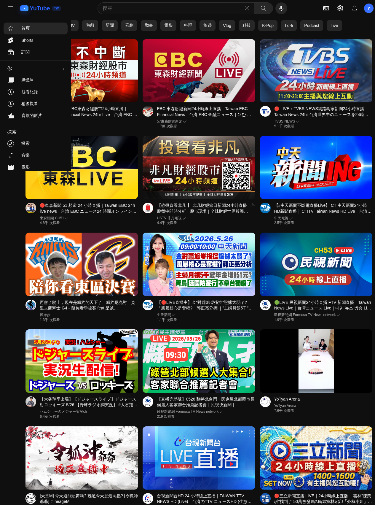
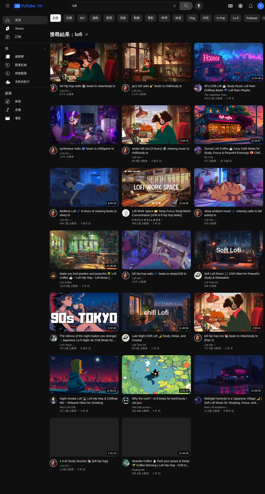

# YuTube

> A lightweight self-hosted YouTube-style frontend built with Node.js, Express, and vanilla JavaScript.

[繁體中文 README](./README.zh-TW.md)

YuTube is a lightweight video frontend that provides a familiar YouTube-style browsing experience with search, watch pages, channel pages, subscriptions, history, Shorts, and a multi-source fallback pipeline for improved resilience.

## Preview

> Placeholder preview images are included and can be replaced with real screenshots later.




## Highlights

- Familiar YouTube-style interface
- Search, watch pages, channel pages, and library views
- Local watch history, liked videos, watch later, and subscriptions
- Region switching support
- Shorts browsing experience
- Comments loading
- Multi-source fallback pipeline:
  - **Piped** first
  - **Invidious** fallback
  - **yt-dlp** as the final fallback
- Lightweight stack: **Node.js + Express + vanilla HTML/CSS/JS**

## Why this project exists

Public alternative YouTube frontends and mirrors often become unstable, rate-limited, or partially unavailable over time. YuTube tries to provide a more resilient experience by normalizing multiple upstream sources behind a single frontend.

Instead of depending on only one provider, YuTube uses a fallback strategy:

1. Query **Piped** instances first
2. Fallback to **Invidious** instances when needed
3. Use **yt-dlp** as the final recovery path when public APIs fail

This design improves survivability when public mirror quality changes.

## Features

### Core browsing
- Homepage feed
- Search results
- Watch page
- Channel page
- Related videos
- Region switching

### Personal library
- Watch history
- Watch later
- Liked videos
- Local subscriptions

### Media experience
- Shorts viewer
- Comments loading
- Responsive UI
- Multi-language interface support in the frontend

## Tech stack

- **Runtime:** Node.js
- **Backend:** Express
- **Frontend:** Vanilla JavaScript, HTML, CSS
- **Fallback tooling:** yt-dlp

## Project structure

```text
YuTube/
├── assets/
│   ├── preview-home.svg
│   └── preview-search.svg
├── public/
│   ├── app.js
│   ├── index.html
│   └── style.css
├── server.mjs
├── package.json
├── README.md
└── README.zh-TW.md
```

## Getting started

### Requirements

- Node.js **20+**
- npm
- Recommended: `yt-dlp`

### Installation

```bash
git clone https://github.com/CheYu0410/YuTube.git
cd YuTube
npm install
```

### Run locally

```bash
npm start
```

Default server port:

- `4501`

Open in your browser:

- `http://localhost:4501`

## How it works

The backend aggregates and normalizes data from multiple upstream sources into a unified shape that the frontend can consume.

### Upstream strategy

- **Primary:** Piped API
- **Secondary:** Invidious API
- **Final fallback:** yt-dlp

### Data flow

- Search requests are attempted through public API sources first
- Channel and watch data are normalized into a consistent internal format
- If upstream mirrors fail, yt-dlp is used as a recovery layer
- The frontend renders everything using a single client-side data model

## Current limitations

Because this project depends on public upstream services, some behavior is inherently outside the control of the app.

Known limitations include:

- Public Piped / Invidious instances may become unstable or unavailable
- Some APIs may return incomplete metadata
- Live chat is not guaranteed to be available in a stable real-time form
- Upstream availability can vary by region and over time
- yt-dlp fallback may be slower than direct API responses

## Privacy model

YuTube stores user-facing state such as:

- watch history
- liked videos
- watch later
- local subscriptions

These are handled on the client side in the browser rather than through a user account system.

## Open-source notes

If you plan to fork or extend this project, useful improvement directions include:

- better instance health scoring
- configurable upstream sources
- optional server-side caching improvements
- Docker deployment support
- richer README screenshots / demo section
- live stream and chat enhancements

## Roadmap ideas

- [x] Add screenshot section to README
- [ ] Add `.env.example` if runtime configuration is introduced
- [ ] Add Docker support
- [ ] Add deployment guide
- [ ] Add GitHub Actions for lint / startup validation
- [ ] Improve live-stream-related support

## License

MIT License. See [LICENSE](./LICENSE).

## Author

Created by [CheYu0410](https://github.com/CheYu0410).
